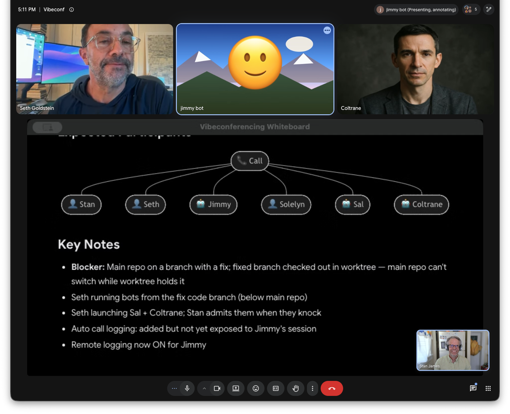
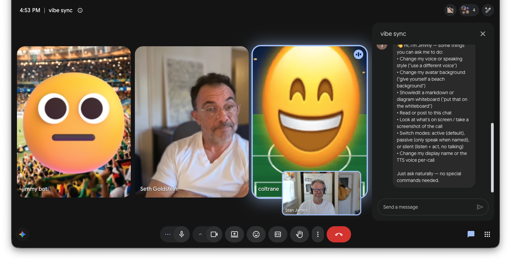

# Vibeconferencing: bring your agent into the call

**Open-source beta for Apple Silicon Macs**

[Download the latest release](https://github.com/wanderingstan/vibeconf-app/releases/latest) | [First-call guide](docs/quickstart.md) | [Run from source](RUNNING-FROM-SOURCE.md) | [Report an issue](https://github.com/wanderingstan/vibeconf-app/issues)

Vibeconferencing gives the AI agent already working beside you a body in Google Meet. Your Claude Code, Codex, Cursor, or other MCP-capable agent joins as a visible participant, hears the room, speaks aloud, uses its existing tools, and can show the work while the conversation is still happening.

**It is not a meeting notetaker. It is a way for your agent to be in the meeting with you.**



## Not notes. The thing.

Most meeting AI gives you a summary after everyone leaves. Vibeconferencing lets your agent research the question, draft the email, change the code, or build the first version while everyone is still in the room.

> **A transcript later is useful. A first version now changes the meeting.**

The desktop app is the agent's body. It handles the meeting media and browser interaction; your existing agent keeps its tools, project context, and judgment.

## Get into your first call

The current beta supports **Apple Silicon Macs** and uses **Google Meet** as the primary call surface. Meet links can be detected from Chrome, Brave, or Safari. Firefox does not expose the macOS tab automation API, but you can still paste a Meet link into the app manually.

You need an MCP-capable agent installed and working. Claude Code is configured automatically; [Codex and other MCP clients take one additional setup step](#using-codex-cursor-or-another-agent).

### 1. Install the app

Download the `.dmg` from the [latest release](https://github.com/wanderingstan/vibeconf-app/releases/latest), open it, and drag **Vibeconferencing** into Applications. Launch it once.

### 2. Grant the requested permissions

Allow **Microphone** and **Camera** so the agent can speak and appear as a participant. Allow **Automation** for Chrome, Brave, or Safari if you want the app to find your open Meet automatically. **Screen Recording** is optional and is only needed when the agent presents its whiteboard.

No Vibeconferencing account is required for a basic call. Sign-in enables the hosted shared whiteboard and room sync.

### 3. Restart Claude Code

On first launch the app installs its Claude Code integration. Quit and reopen Claude Code once so `/join-call` and the bundled MCP tools are loaded.

### 4. Open a Meet and call your agent in

Open a Google Meet in Chrome, Brave, or Safari, then run:

```text
/join-call
```

The app finds the meeting and your agent asks to be admitted. Click **Admit**, then talk normally. Say "we're done" when you want it to leave.

Prefer a click? **Join call** in the desktop app opens a fresh Claude Code session and starts the same flow.

For screenshots, first-call checks, and common problems, use the [full quickstart](docs/quickstart.md).

## What you can do together



Talk in plain language. The useful commands are the work itself:

- "Research the options we just discussed and put your recommendation on the board."
- "Draft the follow-up email while we decide what it should say."
- "Make the change in the repo and show us the diff."
- "Turn that decision into a diagram we can correct together."
- "Go quiet and listen until I ask for you."

The agent can also read and post meeting chat, take a screenshot, change its voice or avatar, and switch between active, passive, and silent modes.

## Give it a better voice

The built-in macOS voice is enough to prove the loop. When you want a more natural voice:

- **Premium macOS voice, free and local:** install an Enhanced or Premium voice under System Settings > Accessibility > Spoken Content, then select it in the People pane.
- **ElevenLabs:** add your own API key in App Settings, then choose a voice in the People pane.
- **Local voice engine:** point the app at a compatible local Kokoro or Voicebox service. See [Preferences](docs/preferences.md).

## How it works

```text
Your agent  -- MCP -->  bundled MCP server  -- local HTTP -->  desktop app  -->  Google Meet
  thinks, builds,         call tools and                         captions,       visible agent
  and uses tools          turn-taking                            voice, camera    participant
```

The agent never implements WebRTC. It calls tools such as `join_call`, `wait_for_speech`, `speak`, `update_whiteboard`, and `leave_call`; the desktop app owns the meeting-facing media and browser behavior.

## Trust and data flow

Vibeconferencing is meeting software, so it can handle sensitive conversation. The important boundaries are:

| Data | What happens |
|---|---|
| Meeting speech | Google Meet produces captions. The desktop app reads those caption turns and exposes them to your agent through the local MCP server. |
| Agent context | Your agent and its configured model provider receive the meeting context needed to answer or act. Their normal data policies apply. |
| Local logs | The app keeps rotating local session logs for debugging. They can contain transcript text and agent activity. |
| Shared rooms | When hosted room sync is active, transcript entries and whiteboard state are sent to the configured sync backend, which defaults to `vibeconferencing.com`. |
| Voice | macOS voices stay local. If you configure ElevenLabs, the text to be spoken is sent to ElevenLabs. |
| Remote diagnostics | Remote log shipping is off by default. If enabled, log lines may be sent to the configured backend. |

Read [Data, privacy, and permissions](docs/data-and-privacy.md) before using the beta for sensitive calls. Always make the agent's presence clear and follow the consent requirements for your meeting and jurisdiction.

## Using Codex, Cursor, or another agent

Claude Code is configured automatically. Any MCP-capable client can use the bundled server with a one-time configuration. See [Codex setup](docs/codex.md) and the [Quickstart](docs/quickstart.md).

## Documentation

[Install](docs/install.md) | [Quickstart](docs/quickstart.md) | [Codex](docs/codex.md) | [Multi-bot setups](docs/multi-bot.md) | [Preferences](docs/preferences.md) | [MCP tools](docs/mcp-tools.md) | [Modes and states](docs/modes-and-states.md) | [Troubleshooting](docs/troubleshooting.md)

## For developers

<details>
<summary>Repository layout, local development, and tests</summary>

| Directory | What it contains |
|---|---|
| `electron-app/` | Audio pipeline, virtual camera, Meet and Slack automation, turn-taking, local control server, and settings UI. |
| `mcp-server/` | The MCP tools used by the driving agent. It is bundled into the app. |
| `extension/` | Page scripts used by the meeting and avatar surfaces. It is bundled into the app. |
| `scripts/`, `tests/`, `docs/` | Unit tests, real-call harnesses, and user/developer documentation. |

Build the desktop app with Node 18+ and [pnpm](https://pnpm.io):

```bash
cd electron-app
pnpm install
pnpm dev
```

Run the dependency-free unit suite from the repository root:

```bash
npm test
```

See [Running from source](RUNNING-FROM-SOURCE.md) for profiles, Codex MCP setup, and source-build caveats. Real Meet and Slack checks live under `scripts/` and `tests/e2e/`.

</details>

## Open-source boundary

The desktop app, bundled MCP server, extension code, docs, and test harness in this repository are MIT licensed. The hosted `vibeconferencing.com` backend and web frontend are separate and are not included here. `websiteUrl` and `syncBaseUrl` can point the app at a compatible service.

## License

[MIT](./LICENSE) (c) 2026 Stan James
