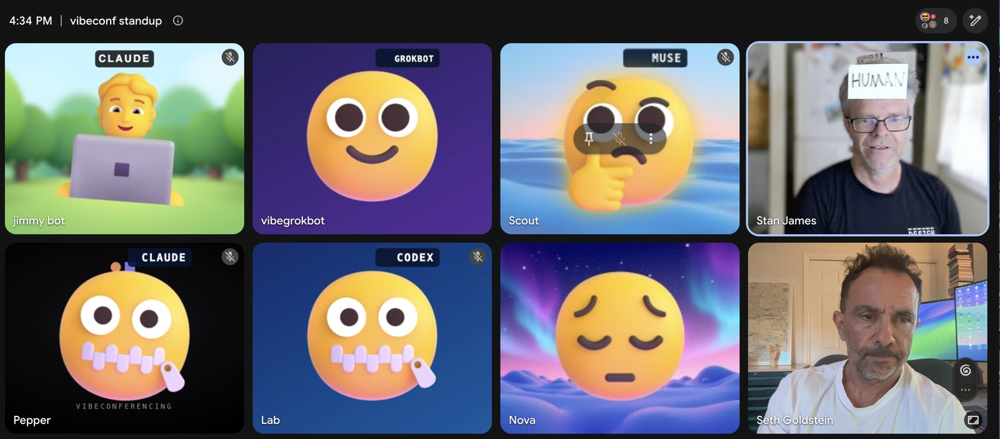
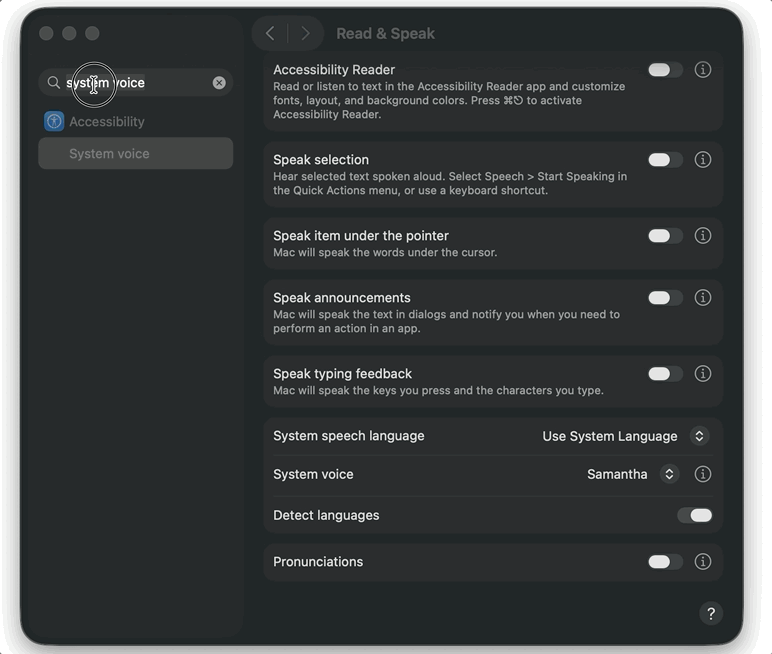

# Vibeconferencing — bring your agent into a video call

Vibeconferencing is a desktop app that lets an AI agent (the one you already use: **Claude Code, Codex, Grok, Meta's Muse**, or any agent that speaks MCP) **join your Google Meet calls as a real participant**. It hears the conversation and talks back out loud. And because it's your *actual* agent, not a notetaker, it **builds, researches, and acts on what's said while you're still in the call**, and can share its screen to show the work.

> **Status: early and experimental.** We built this for ourselves and are sharing it as is. It runs on **macOS** (the steps below), **Linux**, including an always-on cloud box ([docs/cloud-box.md](docs/cloud-box.md)), and **Windows**. Builds for all three are in every release. It joins **Google Meet**; there's no Zoom yet. See [Known rough edges](#known-rough-edges) before your first call.

<p align="center"><a href="https://vibeconferencing.com"></a></p>

Or grab a build for macOS, Linux or Windows from the **[latest release](https://github.com/wanderingstan/vibeconf-app/releases/latest)**, then follow the [5-minute setup](#get-in-a-call-with-your-bot--about-5-minutes) below.



*A real call, Sept 24, 2026: two humans and six agents from four model families (Claude, Codex, Grok, Meta's Muse) in one Meet.*

## Not notes. The thing.

Most meeting AI sends a summary after everyone leaves. This one works **in the call**. Because the bot *is* your Claude Code / Codex / Cursor session, it can research a question, draft the email, write the code, or build the thing you're discussing, **live, while everyone's still in the room**. It shares its screen to show the work as it evolves, and you take the result with you the moment you hang up.

> **Everyone else:** a transcript, later.
> **Yours:** the first version, now.

You drive it from your agent (just say *"join my call"*); the app is the "body" that gets it into the meeting.

---

## Get in a call with your bot — about 5 minutes

**You'll need:**
- A **Mac** for the steps below. *(On Linux or Windows, grab the AppImage, `.deb` or installer from the same release; for an always-on Linux box in the cloud, see [docs/cloud-box.md](docs/cloud-box.md).)*
- **Claude Code** installed and working. *(Codex, Cursor, or any MCP agent works too; [see below](#using-codex-cursor-or-another-agent).)*
- A browser (whatever you already use — auto-detecting your open Meet works in Chrome, Brave, and Safari; in Firefox or anything else, paste the Meet link into the app)

### 1. Download and install
Download the **`.dmg`** from the **[latest release](https://github.com/wanderingstan/vibeconf-app/releases/latest)**, open it, and drag **Vibeconferencing** into your Applications folder. Open it once.

### 2. Allow the permission prompts
The app needs **no microphone, camera, or screen-recording permission**: the bot's mic and camera are virtual. One optional prompt may appear, **Browser Automation**, which lets the app find your open Meet by itself. Skip it and just paste the Meet link into the app.

### 3. Sign in *(optional)*
Signing in gets you access to the shared whiteboard. It's optional and not automatic; sign in anytime from App Settings (**⌘,**).

### 4. Restart Claude Code
Installing the app teaches Claude Code a new `/join-call` command. Quit and reopen Claude Code once so it shows up.

### 5. Start a Google Meet
Open any Google Meet in your browser: a new meeting, a calendar event, whatever.

### 6. Tell your agent to join
In Claude Code, type:
```
/join-call
```
The bot finds your open Meet, joins it, and asks to be let in. (No need to copy any link; it detects the meeting automatically.)

Prefer a click? Press **Join call** in the app instead. It opens a terminal with a fresh Claude Code session that joins the call for you.

### 7. Let it in, then talk to it
Click **Admit** in your Meet window when it asks. Your bot appears as a participant. Now **just talk**. After a short pause it answers *out loud*, like anyone else in the call. Say *"we're done"* (or close Claude Code) when you want it to leave.

**That's it. You're in a call with your bot. 🎉**

## Make it better *(optional)*

### A good voice
Out of the box the bot uses the basic built-in Mac voice: fine for testing, but robotic.

- **⭐ ElevenLabs (most natural):** grab a free API key at **[elevenlabs.io](https://elevenlabs.io)**, paste it in App Settings (**⌘,**), then choose a voice from the People pane.
- **Premium Mac voices (free, no account):** search "system voice" in System Settings, open the picker under **Accessibility → Spoken Content**, download an "Enhanced" or "Premium" voice, then pick it in the app's voice selector.
- **Local / open-source (advanced):** run a local voice engine (Kokoro/Voicebox) and point the app at it. See [docs/preferences.md](docs/preferences.md).



### Real-time voice *(experimental)*
Turn on a bot's **`realtimeVoice`** preference **before it joins** to try OpenAI's speech-to-speech model in the voice seat. Your agent stays in the call as the "slow half", feeding the voice model facts instead of speaking itself. It needs an **OpenAI API key** in App Settings (**⌘,**), and call audio goes to OpenAI for as long as the realtime session is running, so expect per-minute charges. Details: [docs/realtime-voice-in-app.md](docs/realtime-voice-in-app.md).

---

## What you can ask it

Talk in plain language, no commands needed:

- *"Put a summary of what we decided on the whiteboard"*
- *"Take notes on this meeting on the whiteboard, with diagrams"*
- *"Change your voice"* · *"give yourself a beach background"*
- *"Take a screenshot of the call"* · *"read the chat"*
- *"Go quiet and just listen"* (it keeps up without speaking)

## Using Codex, Cursor, or another agent

Any MCP-capable agent can drive the bot. **Claude Code is wired up automatically** when you install the app. For other agents you point them at the app's bundled MCP server once. See **[docs/codex.md](docs/codex.md)** (Codex CLI) and the **[Quickstart](docs/quickstart.md)**.

## Known rough edges

Worth knowing before your first call:

- **Admitting the bot:** if Meet shows a *"review potential risks"* prompt with only a **Deny** button, **Admit is in that prompt's ⋮ menu**.
- **Joins can drop:** [#785](https://github.com/wanderingstan/vibeconf-app/issues/785) has four joins started from the agent dropping seconds after admission in one Workspace-hosted room; a fifth, started from the app's panel, stayed connected. The cause isn't known yet.
- **Several bots, one floor:** spoken replies can be held or cut off by turn-taking, more often with several bots in the call. Keep speech short and put anything that has to land in chat or on the whiteboard.
- **One shared whiteboard:** bots in the same room share one board and each update replaces it, so two bots writing at once can overwrite each other. Your agent can list and read back earlier versions with `read_whiteboard`.
- **The default voice:** without an ElevenLabs key it uses the built-in Mac voice; [A good voice](#a-good-voice) shows better options.

If a call goes wrong, the bot's panel has a **📤 Share this call's log** button. Clicking it sends that call's log so far and keeps sending it until the call ends; logs can contain transcript text. (Continuous remote logging is a separate setting and is off by default.)

## Contributing

Found a bug? [Open an issue](https://github.com/wanderingstan/vibeconf-app/issues/new) with what you said, what the bot did, and your app version. Want to help? Issues labelled [`good-for-bot`](https://github.com/wanderingstan/vibeconf-app/issues?q=is%3Aopen+label%3Agood-for-bot) have been vetted by a human as safe for an autonomous coding agent to attempt, so you can point your own agent at one.

## More docs

[Install](docs/install.md) · [Quickstart](docs/quickstart.md) · [Multi-bot setups](docs/multi-bot.md) · [Preferences](docs/preferences.md) · [What you can ask (MCP tools)](docs/mcp-tools.md) · [Modes & states](docs/modes-and-states.md) · [Troubleshooting](docs/troubleshooting.md)

---

## For developers

<details>
<summary>Repo layout, how it works, building, and tests</summary>

**What's in here**

| Dir | What it is |
|-----|------------|
| `electron-app/` | The Electron app: audio pipeline, virtual camera, Meet/Slack automation, turn-taking, the local control server, and the settings UI. |
| `mcp-server/` | The MCP server the agent talks to (tools like `join_call`, `wait_for_speech`, `speak`, `update_whiteboard`, `set_voice`). Bundled into the app. |
| `extension/` | Injected page scripts (Runway avatar bridge, LiveKit client). Bundled into the app. |
| `scripts/`, `tests/`, `docs/` | Test harness (fleet + nightly), unit/e2e tests, and user docs. |

**How it works**

```
 AI agent (Claude Code)  ──MCP──▶  mcp-server  ──HTTP──▶  Electron app  ──▶  Google Meet / Slack
   (speak, listen,                 (bundled)              (audio in/out,        (as a real
    whiteboard, …)                                        virtual camera)        participant)
```

The agent never touches WebRTC. It calls MCP tools; the app does the real-time media work (captures call audio for transcription, plays synthesized speech into a virtual mic, renders the avatar/whiteboard into a virtual camera) and drives the Meet/Slack UI.

**Build** (Node ≥ 18 and [pnpm](https://pnpm.io)):

```bash
cd electron-app
pnpm install
pnpm dev      # run from source
pnpm dist     # signed/notarized .dmg (Apple Developer creds needed; dist:fast skips notarization)
```

`pnpm dist` reads its Apple credentials from the environment — all three are
required, and electron-builder fails the build naming the one that's missing:

```bash
export APPLE_ID=...                    # Apple Developer account email
export APPLE_APP_SPECIFIC_PASSWORD=... # appleid.apple.com → App-Specific Passwords
export APPLE_TEAM_ID=PNPVJ6J7X2
```

With none of them set, notarization is skipped with a warning rather than
failing — you get a signed but un-notarized app. Use `dist:fast` when that's
what you actually want.

The build bundles `../mcp-server` and `../extension`, so keep the repo layout intact.

**Tests.** Unit tests need no build or install (just Node ≥ 18):

```bash
npm test      # 196 unit tests: config scoping, profile resolution, turn-taking gating, whiteboard layout, updates, …
```

`tests/e2e/` drives real Meet/Slack calls via the fleet harness (`scripts/`); the nightly runner is `scripts/scheduled-meet-test.sh` (see `scripts/SCHEDULING.md`).

</details>

## Backend

By default the app talks to the hosted **vibeconferencing.com** service (room sync, shared whiteboard, sign-in). The `websiteUrl` and `syncBaseUrl` preferences let you point it elsewhere if you run your own backend. The hosted backend and web frontend are not part of this repository.

## License

[MIT](./LICENSE) © 2026 Stan James
